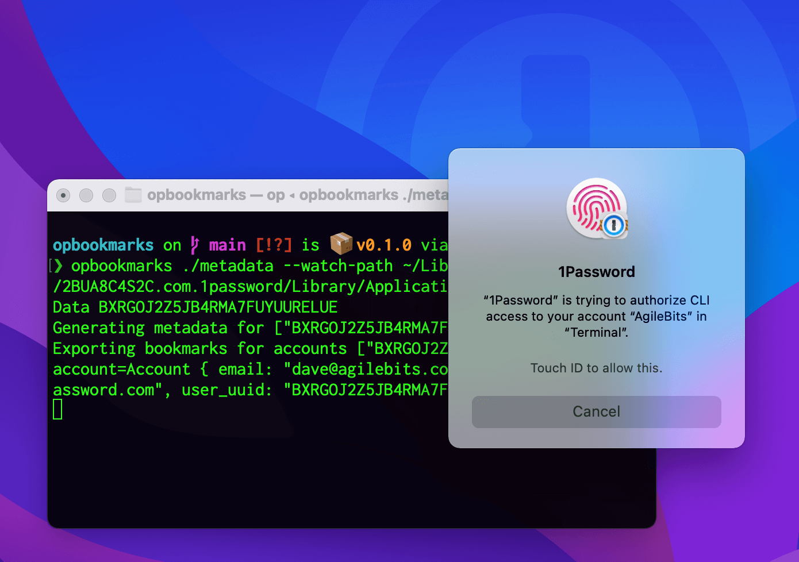

# 1Password Bookmarks

Several great utilities like [Alfred](https://www.alfredapp.com) and [LaunchBar](https://www.obdev.at/products/launchbar/index.html) integrate with 1Password 7 for Mac to provide 1Click Bookmarks[^1][^2].

These integrations are powered by plain-text metadata that 1Password 7 users can opt-in to creating. This metadata can also be used by Spotlight.

1Password 8 supports a new CLI that provides a secure and more feature-rich option for 3rd parties to integrate with.

This project uses the 1Password CLI to generate the identical metadata files to preserve functionality until apps have a chance use the CLI themselves directly.



## Building

For the time being there is no downloadable installation available. Instead, you will need to clone this repo and build it.

Built and tested with [Rust](https://www.rust-lang.org) 1.59.0.

- `git clone`
- `cd opbookmarks`
- `cargo build`

The built executable can be found in `target/debug/opbookmarks`.

## Usage

```
USAGE:
    opbookmarks <EXPORT_PATH> <WATCH_PATH> [ACCOUNTS]...

ARGS:
    <EXPORT_PATH>    The path to export the metadata files to. Typically the same path that
                     1Password 7 used, namely
                     ~/Library/Containers/com.agilebits.onepassword7/Data/Library/Caches/Metadata/1Password
    <WATCH_PATH>     The path to the 1Password 8 database file to watch. Typically
                     ~/Library/Group\ Containers/2BUA8C4S2C.com.1password/Library/Application\
                     Support/1Password/Data
    <ACCOUNTS>...    Account user UUIDs to generate metadata for. Defaults to all accounts. Use
                     commas to separate multiple accounts. UUIDs can be found using `op account
                     list`
```

By default the 1Password 8 data folder will be monitored for changes. The FSEvents API provided by Apple is use and so this is efficient enough to leave running in the background indefinitely.

Use `nohup` and append `&` to the above command to allow it to run even after the Terminal window is closed. For example to watch a single account indefinitely:

`nohup cargo run $EXPORT_FOLDER $OP8_DATA_FOLDER BXRGOJ2Z5JB4RMA7FUYUURELUE &`

## History

In 1Password 7 users could enable Preferences > Advanced > Enable Spotlight and 3rd party app integrations. Doing so would create files like these within `~/Library/Containers/com.agilebits.onepassword7/Data/Library/Caches/Metadata/1Password`:


Each of these were json files with these fields:

```
{
  "uuid": "7ktc3vp6rjdwhosepdeosmefeq",
  "itemDescription": "Login from Papa🐻",
  "itemTitle": "Evernote personal",
  "vaultName": "Papa🐻",
  "vaultUUID": "nunyxtz72vd7dkzprjxzo4acqy",
  "categoryPluralName": "Logins",
  "modifiedAt": 1611606417,
  "profileUUID": "nunyxtz72vd7dkzprjxzo4acqy",
  "websiteURLs": ["https://www.evernote.com/Registration.action"],
  "categorySingularName": "Login",
  "categoryUUID": "001",
  "accountName": "Teare 👨‍👩‍👧‍👦 Fam",
  "createdAt": 1520813775
}
```

## Tighter integration

The CLI can do a lot more than is possible with plain text metadata files. Things like usernames could be included alongside the titles in item lists, items can be created within 1Password, and in theory the entire 1Password experience could be recreated.

This integration would no longer rely on unprotected plain text files, and with the new CLI users can authorize access using Touch ID or their Apple Watch.

There are innumerable possibilities as `op` is a full-featured CLI that supports CRUD of items, vaults, and even accounts.

I'm looking forward to exploring all the possibilities this unlocks! 😍

[^1]: [Alfred+1Password integration](https://www.alfredapp.com/help/features/1password/)
[^2]: [LaunchBar+1Password features](https://www.obdev.at/products/launchbar/features.html)
